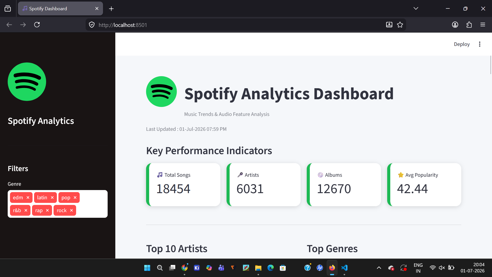

# 🎵 Spotify Song Trends & Audio Feature Analysis

A Python-based data analytics project that analyzes Spotify song data to discover music trends, artist performance, genre popularity, album performance, and audio features. The project includes an interactive Streamlit dashboard with KPIs, filters, business insights, and visualizations.

---

# 📌 Project Overview

This project focuses on exploring Spotify song data using Python. It demonstrates the complete data analytics workflow including:

- Data Cleaning
- Data Processing
- Exploratory Data Analysis (EDA)
- Business Insights
- Interactive Dashboard Development

The dashboard enables users to interactively explore Spotify data through filters, charts, KPIs, and downloadable datasets.

---

# 🚀 Features

### Dashboard

- Professional Spotify-themed UI
- Interactive Sidebar Filters
- KPI Cards
- Business Insights
- Responsive Layout

### Filters

- Genre Filter

### Key Performance Indicators (KPIs)

- 🎵 Total Songs
- 🎤 Total Artists
- 💿 Total Albums
- ⭐ Average Popularity

### Charts

- Top 10 Artists by Number of Songs
- Genre Distribution
- Songs Released Per Year
- Popularity vs Danceability
- Average Energy by Genre
- Top 10 Albums by Popularity

### Dataset

- Interactive Data Table
- Download Dataset as CSV

---

# 📊 Dashboard Screenshots

## 🏠 Dashboard Home

Displays the dashboard title, KPIs, and business overview.

<p align="center">

</p>

---

## 🎛 Sidebar Filters

Users can filter songs by Genre to dynamically update all charts.

<p align="center">

</p>

---

## 📈 Artist & Genre Analysis

Top 10 Artists and Genre Distribution.

<p align="center">

</p>

---

## 📉 Release Trend & Popularity Analysis

Songs Released by Year and Popularity vs Danceability.

<p align="center">

</p>

---

## 🎵 Energy & Album Analysis

Average Energy by Genre and Top 10 Albums.

<p align="center">

</p>

---

# 📊 Business Insights

- Queen has the highest number of songs in the dataset.
- Pop is the most popular playlist genre.
- Song releases increased significantly after 2010.
- Danceability has only a moderate relationship with popularity.
- EDM genre has the highest average energy level.
- Popular albums consistently achieve higher average popularity scores.

---

# 🛠 Technologies Used

- Python
- Pandas
- NumPy
- Matplotlib
- Streamlit
- OpenPyXL

---

# 📂 Project Structure

```
Spotify-Song-Trends-and-Audio-Feature-Analysis
│
├── dataset
│   └── spotify_songs.xlsx
│
├── output
│   ├── dashboard_home.png
│   ├── sidebar.png
│   ├── charts_1.png
│   ├── charts_2.png
│   └── charts_3.png
│
├── source
│   └── spotify_songs.ipynb
│
├── app.py
├── requirements.txt
└── README.md
```

---

# ⚙ Installation

Clone the repository

```bash
git clone https://github.com/YOUR_USERNAME/Spotify-Song-Trends-and-Audio-Feature-Analysis.git
```

Move into the project folder

```bash
cd Spotify-Song-Trends-and-Audio-Feature-Analysis
```

Install dependencies

```bash
pip install -r requirements.txt
```

Run the Streamlit application

```bash
streamlit run app.py
```

---

# 📈 Future Enhancements

- Artist Filter
- Album Filter
- Language Filter
- Release Year Filter
- Dark/Light Theme Toggle
- Plotly Interactive Charts
- Predict Song Popularity using Machine Learning
- Deploy Dashboard on Streamlit Cloud

---

# 👨‍💻 Developed By

**Gnana Jothi M**

Electronics and Communication Engineering

Aspiring Data Analyst

---

# 📄 License

This project is developed for educational and portfolio purposes.